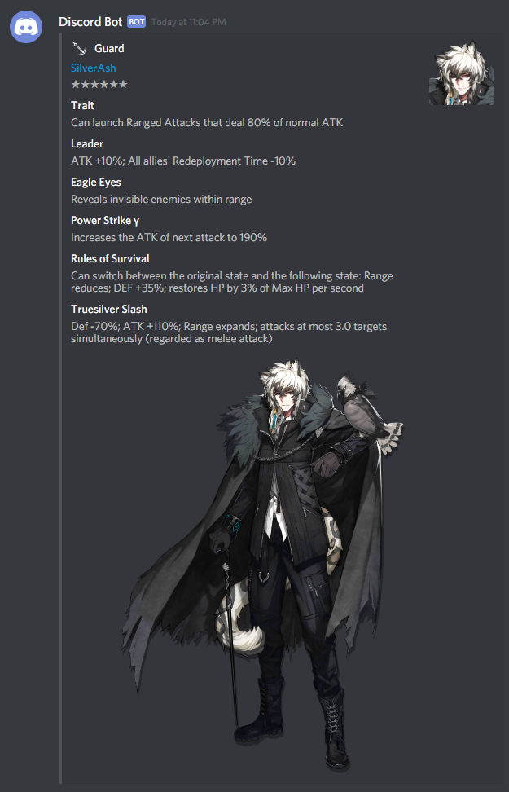

# Arknights Embed Builder
## [data_cleaning.py](./Code/data_cleaning.py)
This script will transform the character and skill data `.json` files from [Aceship](https://aceship.github.io/) and output to a cleaned file for use in the discord embed building code. This script should only be needed to update the included `cleaned_characters.json` from this repo.

Please see [this readme](./Data/README.md) for how to download the raw `.json` it expects.

## [arknights.py](./Code/arknights.py)
Contains a few functions, but of interest is `arknights(name)`, which will fuzzy search its input with a list of operators and then return a discord embed object for use with a discord bot.

### To Do
Add parameter to select Elite 2 art & portrait for 4* and above operators

#### Example Output
{:target="_blank"}\
*Courtesy of [Embed Visualizer](https://leovoel.github.io/embed-visualizer/)*
